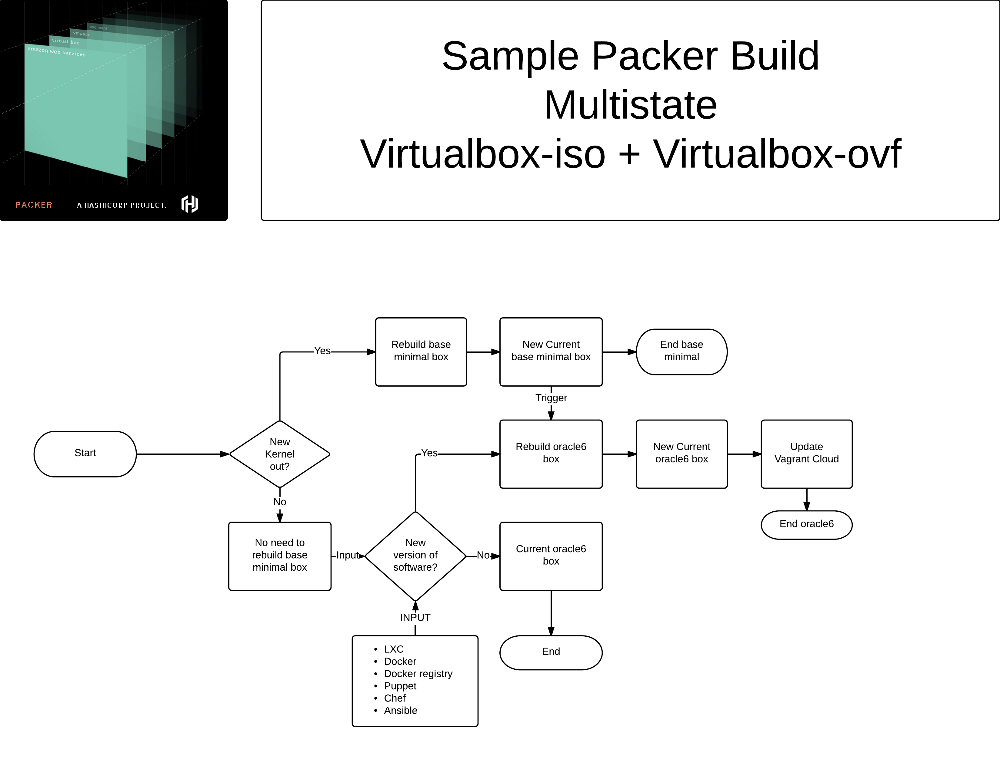

# packer-make

This is a packer workflow driven by make.

This require [packer](http://packer.io) and one or both of the [provisioners](https://packer.io/docs/templates/provisioners.html)
[virtualbox](http://virtualbox.org)
[vmware workstation/fusion](http://vmware.com)

## Main goal:

The goal behind this, is to leverage on make for what he does best, that is check dependencies and rebuild when needed.

## TL;DR

Choose [oracle7-1pass](oracle7-1pass) or [oracle7-2pass](oracle7-2pass)

Edit Makefile for provisioner, vmware, virtualbox or both, as is is both

Copy oracle7-latest.json as example, say new oracle7-httpd.json

Update the variable section:

```json
    "variables": {

        "vm_name": "oracle7-httpd",

    },

}
```

And update the script part that install the software
ie to install apache httpd:

FROM:

```json
      "echo your custom inline script",
      "echo goes here"
```

TO:

```bash
      "yum install -y httpd mod_ssl"
```

```
Note: This is json, so last line without ',' at the end
```

Base box does include epel but it's disable, if you need anything from epel, use:

`yum --enablerepo=epel install <package>` 

### 1 pass, iso to vm

cd [oracle7-1pass](oracle7-1pass) 

Edit Makefile for provisioner, default is virtualbox and vmware

First run of `make` will create VM from all json files, packer will download the iso, and then build the boxes.

For new VM, use oracle7-latest.json as example

Run `make` and this will do all the job

### 2 pass, use an intermediate vm

Edit Makefile for provisioner, default is virtualbox and vmware

cd [oracle7-2pass](oracle7-2pass)

Edit Makefile for provisioner, default is virtualbox and vmware

First run of `make` will create a base VM, then will create VM from all json files, packer will download the iso, and then create an intermediate box.

For new VM, use oracle7-latest.json as example

for virtualbox will be `output-oracle7-ovf-virtualbox/`

for vmware will be `output-oracle7-vmx-vmware/`

and then, the new vm will use `virtualbox-ovf` and `virtualbox-vmx` to speed up the process

### Now what?

Go to the end, code section and test what's suits you better.

## Long explanation

### Assumptions

This project, assume you know what [packer](http://packer.io) is, and you have created vm with packer before

This project, also assume you want your boxes to be used by [vagrant](http://vagrantup.com) so a vagrant post-processor is included

## Normal workflow:

A normal packer workflow goes like this:

1. Create a VM
1. Put the iso
1. Create a web server and share kickstart/preseed file
1. Turn on vm
1. Using the console/keyboard tell the installer to pick the response file
1. un-attended OS installation
1. post-installation scripts
1. Profit!

Things start getting complex as the boxes age and in order to keep size to minimum, instead of patching, we recreate the box.

So, for serveral boxes, you have several packer templates (json files), and you need to somehow decide when to rebuild, some/all of the boxes or just the new ones.

## Make for the non-developers (like me)

### Basic explanation

Enter make!

sample makefile:

```c
hello: hello.c
	gcc -o hello hello.c
```

This simple example is quite interesting.

We have the target `hello` that is a compiled software.
We have the pre-requirement `hello.c`
And we have the command to generate `hello` that is `gcc -o hello hello.c`

So, go to [sample](sample) and have a look to this `sample` project.

On first run, due `hello` program doesn't exist, and the pre-requisite exist, so make have all it need to generate the code, so will execute the code to generate `hello` from `hello.c`

### Having fun with Make:

So, lets tell make we want him take care of our project:

```bash`
$ make
gcc -o hello hello.c
$ make
make: `hello' is up to date.
```

Good stuff, due `hello` wasn't present, make did generate on first run.

On second run, make is telling us the project is `up to date`.

Let's update our source code:

```bash
$ touch hello.c 
$ make
gcc -o hello hello.c
$
```

This is quite cool.

### Make and dependencies

So make take care of following dependencies, and the power of Make doesn't stop there.

This simple project:

```c
hello: hello.c
	gcc -o hello hello.c
```

Can become something like:

```c
hello: hello.c <pre-req2> .. <pre-reqN>
	gcc -o hello hello.c
```

Which is something we will use for packer.

### Simple Makefile for packer

A simple project for packer, require a `Makefile` and a `packer templatefile` and would look like this:

```c
virtualbox.box: packer-template.json <some_external_dependencies.txt>
	packer build packer-template.json
```

Which is pretty simple and make a lot fo sense:
- if the `virtualbox.box` doesn't exist, make will run packer
- if the pre-requirement is updated, Make will regenerate our image.

So far so good.

## Oracle Linux

On this example, I will be using Oracle Linux, you can modify this for any OS you want.

In Oracle Linux, we have a `yum repo` for 
[kernel](http://public-yum.oracle.com/repo/OracleLinux/OL7/UEKR3/x86_64)
, and a `yum repo` for 
[packages](http://public-yum.oracle.com/repo/OracleLinux/OL7/latest/x86_64)
, so you can use this to create a file that make will use as dependencie, if the dependencie gets updated, make will rebuild our vms.

This may sound simple and trivial, but if you have a bunch of boxes in different levels ie `OL7/OL6/OL5` using diferent Oracle Linux Unbreakeable Kernel `uek/uek2/uek3/playground` plus some using the `redhat compatible one` and a bunch of different boxes for task like `minimal`, `nginx`, `docker`, etc.. you get the idea, a lot to track.

So, let's use `Make` for what it does best

```
ol7_uekr3:=$(shell curl -R -I <url_for_kernel_repo_metadata> -o ol7_uekr3.tx)
ol7_latest:=$(shell curl -R -I <url_for_packages_repo_metadata> -o ol7_latest.txt)
```

With this simple code, on each `Make` run, it will generate a file, with the `header` information and the `time stamp` of the last change.

The first time we run `Make` it will run packer and create the boxes, and later, if the `packer template` or `yum repo` gets updated, only then, make will kick a rebuild.


## One (1) pass

cd into [oracle7-1pass](oracle7-1pass), and run `make`

On first run, `make list` will show us what will be generated:

```bash
$ cd oracle7-1pass/
$ make list
virtualbox/oracle7-docker.box
virtualbox/oracle7-latest.box
virtualbox/oracle7-nginx.box
vmware/oracle7-docker.box
vmware/oracle7-latest.box
vmware/oracle7-nginx.box
$ 
```

So, we have 2 providers `virtualbox` and `vmware`, and 3 boxes.

On my mac mini with ssd disk the first run was:

```
real    106m46.521s
user    14m23.382s
sys     2m59.531s
```

and if I run `make` again:

```
$ make
make: Nothing to be done for `all'.
$
```

Not bad!

If I want to add a new box, I just copy one of the `packer templates json file` like `nginx`, and create a new one for `httpd`

Update the variable section:

```json
    "variables": {

        "vm_name": "oracle7-httpd",

    },

}
```

And update the script part that install the software:

```bash
      "yum install -y httpd mod_ssl"
```

And let's `make` to do the magic:

```bash
$ make list
virtualbox/oracle7-docker.box
virtualbox/oracle7-httpd.box
virtualbox/oracle7-latest.box
virtualbox/oracle7-nginx.box
vmware/oracle7-docker.box
vmware/oracle7-httpd.box
vmware/oracle7-latest.box
vmware/oracle7-nginx.box

$make

==> Builds finished. The artifacts of successful builds are:
--> virtualbox: 'virtualbox' provider box: virtualbox/oracle7-httpd.box

==> Builds finished. The artifacts of successful builds are:
--> vmware: 'vmware' provider box: vmware/oracle7-httpd.box

real    33m24.162s
user    4m30.362s
sys     0m59.775s
```

Lets test the theory:

```bash
$ make
make: Nothing to be done for `all'.
$
```

Sweet!


## Two (2) Pass

So, at this moment we have a `packer` bakery driven by `make`, why optimize it?

On first view, this is cool and works, but if we leave as is, we have doing over-and-over the same heavy work, let's see an example:

nginx:

1. Create a VM
1. Put the iso
1. Create a web server and share kickstart/preseed file
1. Turn on vm
1. Using the console/keyboard tell the installer to pick the response file
1. un-attended OS installation
1. post-installation scripts to get nginx installed
1. Profit!

httpd:

1. Create a VM
1. Put the iso
1. Create a web server and share kickstart/preseed file
1. Turn on vm
1. Using the console/keyboard tell the installer to pick the response file
1. un-attended OS installation
1. post-installation scripts to get httpd installed
1. Profit!

As you can see, much of the process is being repeated, not adding any value at all.

Packer has `virtualbox-iso` and `vmware-iso` to start from an ISO and create a vm.

Packer also has `virtualbox-ovf` and `vmware-vmx` to start from an existing VM and create a new VM.

For my own boxes, I did solve this issue a while ago with this workflow:



If you like the diagram, I did it on lucidchart, and you can see it online with this [link](https://www.lucidchart.com/invitations/accept/a6854afa-0235-4072-a99c-b7fb149a62f2)

Let's put this theory to test, create a new VM after the base one has been built:

cd into [oracle7-2pass](oracle7-2pass), and run `make`

```
$make

==> Builds finished. The artifacts of successful builds are:
--> virtualbox: 'virtualbox' provider box: virtualbox/oracle7-httpd.box

==> Builds finished. The artifacts of successful builds are:
--> vmware: 'vmware' provider box: vmware/oracle7-httpd.box

real    18m10.428s
user    5m0.226s
sys     1m1.908s
```

Ok, about 15 minutes quicker for 1 box, in `virtualbox` and `vmware` provisioner, which is good, say 8 minutes per box, in a multi box setup is a lot.

So, what's different:

First pass (base box):

1. Create a VM
1. Put the iso
1. Create a web server and share kickstart/preseed file
1. Turn on vm
1. Using the console/keyboard tell the installer to pick the response file
1. un-attended OS installation
1. post-installation scripts
1. base box ready

Second pass (our box):

1. Create a VM from base box
1. Turn on vm
1. post-installation scripts to get httpd installed
1. Profit!

## Code

If you want start from ISO, create VM from scratch without intermediate box, use [oracle7-1pass](oracle7-1pass)

If you want to optize if possible, and reuse an intermediate box, use [oracle7-2pass](oracle7-2pass)

In both cases, edit `Makefile` and remove either `virtualbox` or `vmware` if you only want one of the providers.

Copy `oracle7-latest.json` and edit `vm_name` on variables section, and put your script on the script block:

```json
      "echo your custom inline script",
      "echo goes here"
```

Base box include epel but it's disable, if you need anything from epel, use:

`yum --enablerepo=epel install <package>` 

alvaro at kikitux.net

