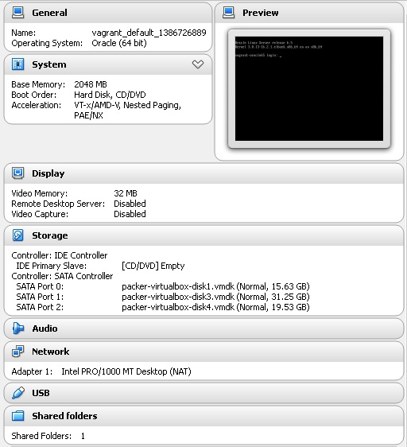

### Short version, quick start

In order to have a quick environment, I have share some [vagrant files in dropbox]

- Download any of the <name>.box

- Add the box into vagrant with 

		$ vagrant box add oracle65 </path/to/the/downloaded/file>

- Verify the machine was imported correctly

		$ vagrant box list

- In a new directory, intialize the image

		$ vagrant init oracle65

- Run `vagrant up` from the base directory of this project. It takes a while..

- Ready to use

After the vagrant box have been imported and initialized, you will have a working virtual machine.

Example of the import of the machine with 3 disks.

### Verbose output

* Import the downloaded <image>.box

		AlvaroM@ALVAROMW8LT ~/vagrant
		$ vagrant box add oracle65 ~/Dropbox/work/packer-vagrant/vagrant/oracle65-3disk.box
		Downloading or copying the box...
		Extracting box...ate: 760M/s, Estimated time remaining: --:--:--)
		Successfully added box 'oracle65' with provider 'virtualbox'!

* Initialize the current directory to work with a given image
note: `this will create a Vagrantfile`

		AlvaroM@ALVAROMW8LT ~/vagrant
		$ vagrant init oracle65
		A `Vagrantfile` has been placed in this directory. You are now
		ready to `vagrant up` your first virtual environment! Please read
		the comments in the Vagrantfile as well as documentation on
		`vagrantup.com` for more information on using Vagrant.

* Start of vagrant box

		AlvaroM@ALVAROMW8LT ~/vagrant
		$ vagrant up
		Bringing machine 'default' up with 'virtualbox' provider...
		[default] Importing base box 'oracle65'...
		[default] Matching MAC address for NAT networking...
		[default] Setting the name of the VM...
		[default] Clearing any previously set forwarded ports...
		[default] Creating shared folders metadata...
		[default] Clearing any previously set network interfaces...
		[default] Preparing network interfaces based on configuration...
		[default] Forwarding ports...
		[default] -- 22 => 2222 (adapter 1)
		[default] Booting VM...
		[default] Waiting for machine to boot. This may take a few minutes...
		[default] Machine booted and ready!
		[default] Mounting shared folders...
		[default] -- /vagrant

* Connect and check the disks and partition

		AlvaroM@ALVAROMW8LT ~/vagrant
		$ vagrant ssh
		[vagrant@vagrant-oracle65 ~]$ sudo fdisk -l /dev/sd{a,b,c}

		Disk /dev/sda: 16.8 GB, 16777216000 bytes
		255 heads, 63 sectors/track, 2039 cylinders
		Units = cylinders of 16065 * 512 = 8225280 bytes
		Sector size (logical/physical): 512 bytes / 512 bytes
		I/O size (minimum/optimal): 512 bytes / 512 bytes
		Disk identifier: 0x0003f67d

		   Device Boot      Start         End      Blocks   Id  System
		/dev/sda1   *           1          64      512000   83  Linux
		Partition 1 does not end on cylinder boundary.
		/dev/sda2              64         829     6144000   82  Linux swap / Solaris
		Partition 2 does not end on cylinder boundary.
		/dev/sda3             829        2040     9726976   83  Linux

		Disk /dev/sdb: 33.6 GB, 33554432000 bytes
		255 heads, 63 sectors/track, 4079 cylinders
		Units = cylinders of 16065 * 512 = 8225280 bytes
		Sector size (logical/physical): 512 bytes / 512 bytes
		I/O size (minimum/optimal): 512 bytes / 512 bytes
		Disk identifier: 0x00000000

		Disk /dev/sdc: 21.0 GB, 20971520000 bytes
		255 heads, 63 sectors/track, 2549 cylinders
		Units = cylinders of 16065 * 512 = 8225280 bytes
		Sector size (logical/physical): 512 bytes / 512 bytes
		I/O size (minimum/optimal): 512 bytes / 512 bytes
		Disk identifier: 0x00000000

		[vagrant@vagrant-oracle65 ~]$ logout
		Connection to 127.0.0.1 closed.

[vagrant files in dropbox]: https://www.dropbox.com/sh/3ks3e34en9bbec9/zjtqkm71RD/vagrant 

